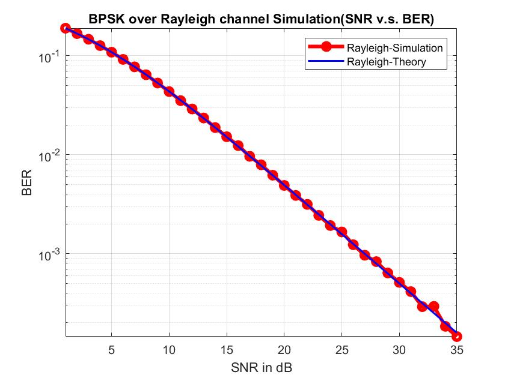
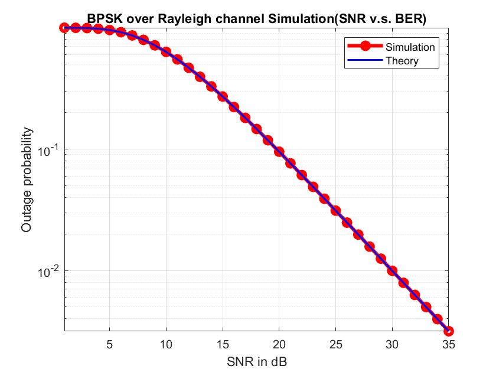
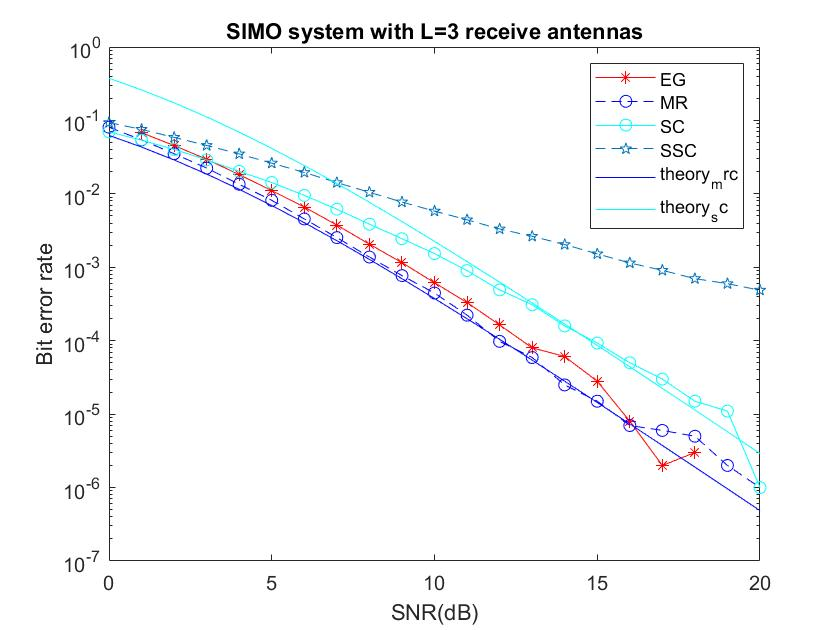
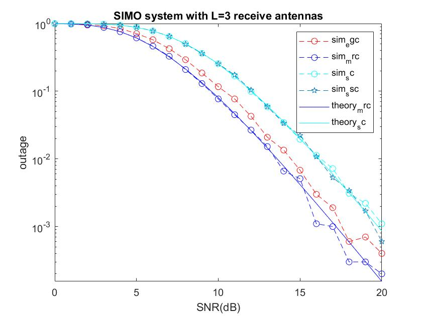
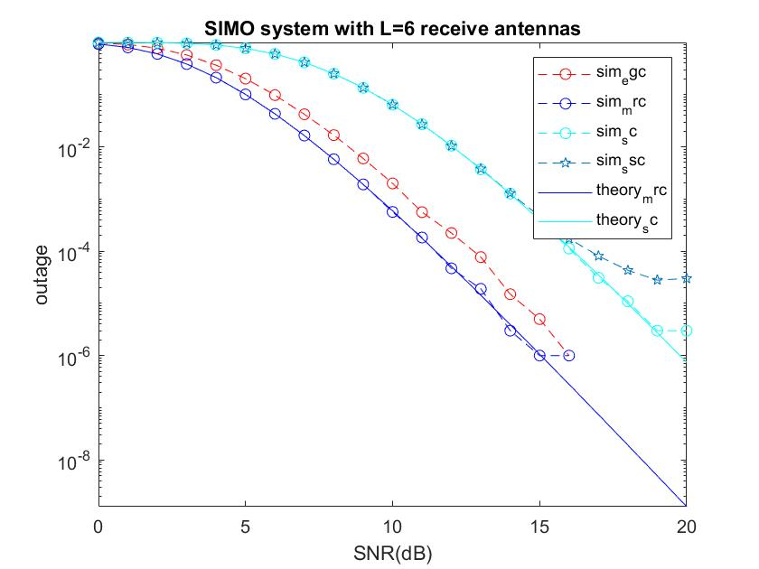

# SIMO-system
This is the simulation of SIMO system.
For BPSK modulation 𝑥[𝑚]∈{±√Es}.Consider an SIMO system with 𝐿 receive antennas.  
Let 𝑦𝑙[𝑚] = ℎ𝑙[𝑚]𝑥[𝑚] + 𝑤𝑙[𝑚] be the received signal at the 𝑙𝑡ℎ antenna in Rayleigh channels,  
where E[|𝑥[𝑚]|^2] = 𝐸𝑏 , and 𝑤[𝑚]~𝐶𝑁(0, 𝑁0). 
Define 𝑆𝑁𝑅 = 𝐸𝑏⁄𝑁0.

I.Simulate the bit error probability and outage probability for BPSK modulation in Rayleigh channels. 
 
II.Simulate the outage probabilities, in terms of 𝑆𝑁𝑅, for the MRC, SC, SSC,and EGC schemes with L receive antennas. 
 
III.Simulate the bit error probabilities, in terms of 𝑆𝑁𝑅, for the MRC, SC, SSC, and EGC schemes with L receive antennas. 

